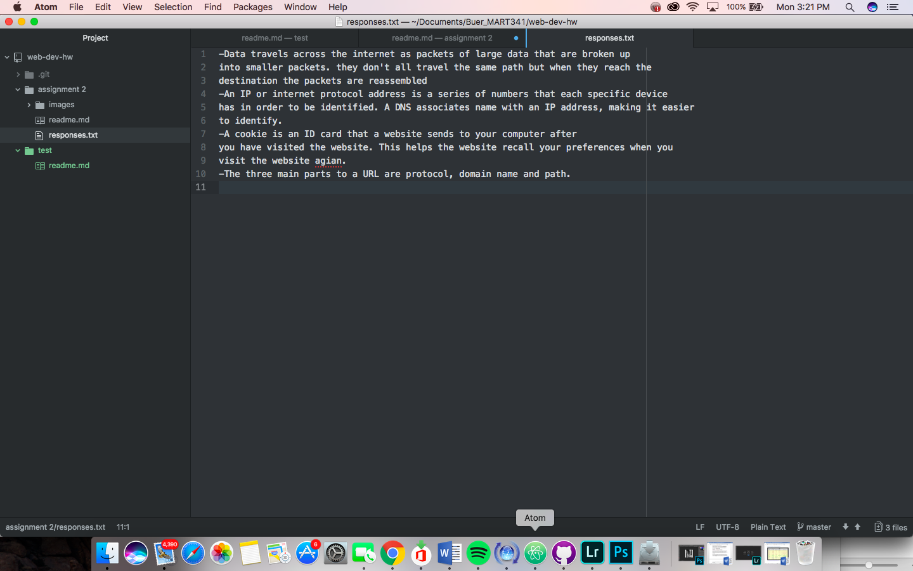

# Assingment 2
A _version control system_ tracks changes as they happen. This helps the user to view their progress. The changes have to be named and described before committed to the master this helps users go back and easily locate a file or change.  We are all using the the version control system github. This creates a shared community to view each others work and collaborate.

[my responses](./responses.txt)

To start this assingment I read through all the information on the course website for this topic. I followed the step by step instructions to set everything up. Through some trial and error I think I have it mostly sorted out. I had some trouble at first with organizing my files. Utilizing the issues board and looking at other students assignments helped me to figure out if I was doing things right. I read through the assignment details carefully and followed the instructions step by step.

