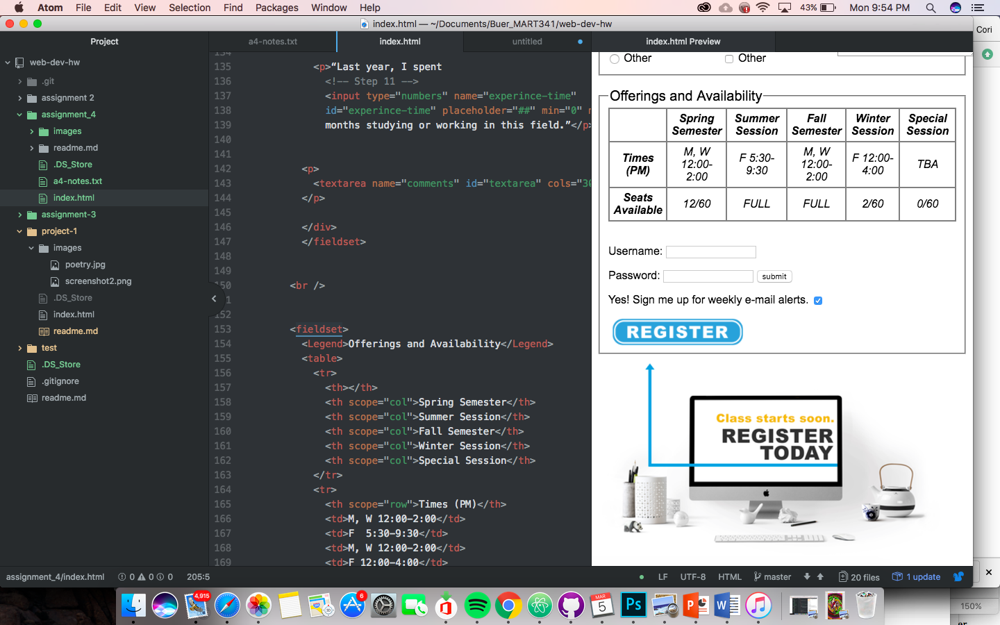

# Assignment 4 Readme

Alt text describes an image if/when the image cannot be seen, it is used for the visually impaired

I come across forms all the time when browsing a website. I enter in passwords and usernames daily. Or when I order things online there a lot of drop boxes to select state to ship to and checkboxes to select type of shipping.

or this assignment I read through the course website. I didn't really run into any issues like I have in the past. I think I'm starting to get a better grasp on coding so its getting a lot easier. I'm starting to memorize some of the tags which cuts down on time.

