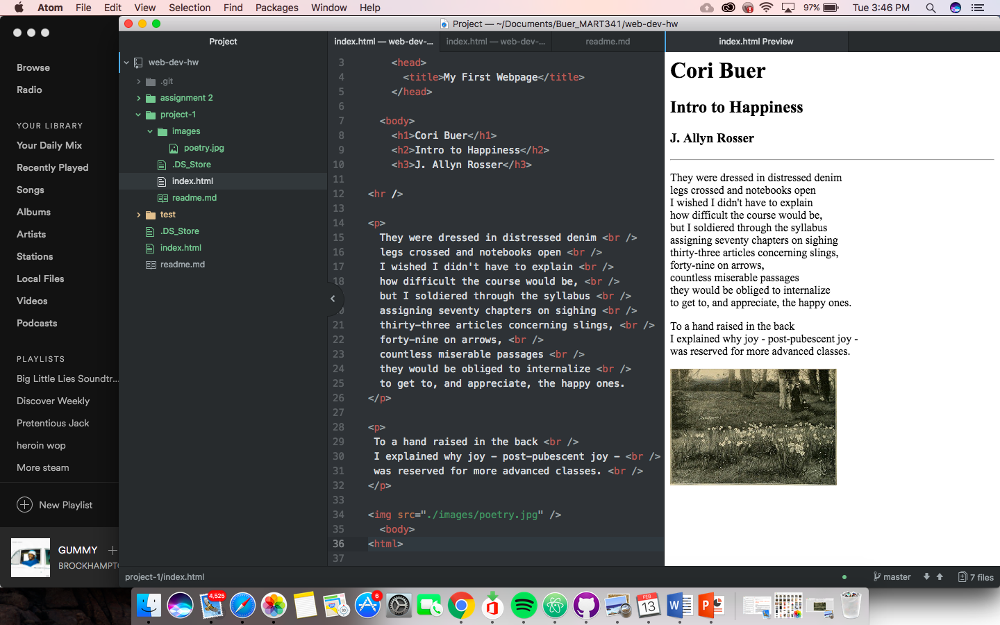

# Project-1 Readme

##### Browsers I use

I use either Google Chrome most often. I will occasionally use safari. I use Chrome on my mobile device. The main function of a browser is to present the web resource you choose, by requesting it from the server and displaying it in the browser window. 

##### Wayback Machine

I found Wayback Machine to be really interesting. Its really cool that all that is archived. I visited Yahoo from 1996. The site looks so much like the index.html document we downloaded and practiced linking on. It seems very rudimentary. Its amazing to see how far the internet has come.

##### Work cycle

For this work cycle I went through all the walkthroughs on the class website. After duing the tutorials and tests I went through the steps of the assignment. I found the poem in a book from my poetry 101 class. I had a lot less difficulty with this project than I did with assignment 3.  

